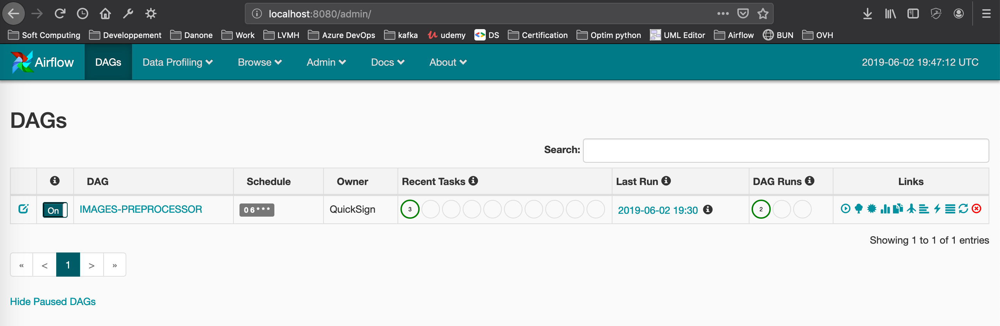
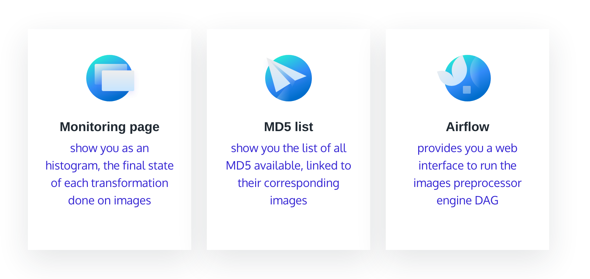

# images-preprocessor

Images preprocessor engine

Description
===========

###goal:
- Get and download all images  from urls.txt file
- Develop a task which compute the MD5 of each image
- Develop a task which compute gray level of the image applying: (R + G + B) / 3
- Get the output of the two precedent tasks, and insert information into a MongoDB database
as: md5, gray level image, size, insertion date.
- Develop a flask webservice to visualize results stored inside the MongoDB by the url http://localhost:5000/image/<MD5>
- Develop a flask webservice to get monitoring from url http://localhost:5000/monitoring. This API will return
an histogram showing the number of image transformed per minutes or per seconds. 

Requirements
============
This project is fully-based on docker container.
Docker has to be installed on your host machine.
See: https://docs.docker.com/install/

Please also check your internet connection, needed for image downloading.

Architecture
============
This project is based on 3 docker container:
- MongoDB database container
- Flask web app container
- Images preprocessor container including Airflow

Installation
============
### Build and run all container
> Go to the project home directory and run:

    docker-compose up
    
This command will create 3 containers. It can take few minutes:

This command will launch:
- The mongoDB database
- The flask web server
- The unit test for images preprocessor
    - If the tests are all success it will launch:
        - The airflow web server
        - The airflow scheduler
        - Trigger once the DAG images preprocessor

Execution
=========
Airflow provides a web interface to run your DAG pipeline.
A Dag is a sequence of task, and each task is an operator running on airflow host.

1. Go to the interface on: http://localhost:8080/admin
2. Be sure the DAG "IMAGES-PREPROCESSOR" is visible and set to "ON"
3. Trigger the DAG clicking on the "play" button on the right side

Once the DAG is finished, you can visualize results on the web UI: http://localhost:5000

On this page you have a:
- "Monitoring page" Menu which shows you how much images have been transformed by seconds
- The "MD5 list" menu linked to the list of image transformed as gray

Then if you scroll down you will see a sticker showing total error and success transformation. You can click
on the histogram to display the image.

Scrolling down more will show you the list of image transformed with their md5. You can click on it 
to diplay the image:

Parameters
==========
You can overwrite some application options directly on airflow Web UI:
1. Go to "Admin" menu and then "Variables"
2. Next you can overwrite the environment and log level variables

- The "ENV" variable can be modified to "prod" to load other property file. In this case it won't change anything because all properties are the same on both files.
- The "LOG_LEVEL" variable can be modified to "INFO" or "DEBUG" to display more logs or not.

Monitoring
==========
To monitor your task execution, airflow provide log application of each task.
1. Click on "Recent tasks" bubble of your choice and click on the task you want to monitor

3. Click on "Log" to get all application logs of your task

Note
====

This project has been set up using PyScaffold 3.1. For details and usage
information on PyScaffold see https://pyscaffold.org/.
